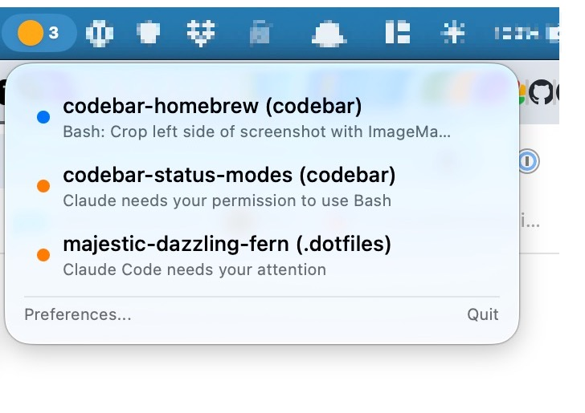
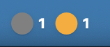

# CodeBar

A macOS menu bar app that monitors your active [Claude Code](https://claude.ai/code) sessions at a glance.



## What It Does

- **Menu bar status** — two display modes (configurable in Preferences):
  - **Single circle** (default) — one circle showing the highest-severity status across all sessions
  - **All active statuses** — one circle per status that has at least one session, each with a count

  

  Status colors:
  - 🔵 **Blue** — working (a tool is executing)
  - 🟠 **Orange** — blocked (waiting for permission)
  - ⚪ **Gray** — idle
- **Click to expand** — see each session with its name, current activity, and status
- **Click a session** — instantly switch to that iTerm2 tab

## How It Works

CodeBar uses [Claude Code hooks](https://docs.anthropic.com/en/docs/claude-code/hooks) to receive real-time status updates. When Claude Code runs a tool, waits for permission, or finishes a response, it POSTs an event to CodeBar's local HTTP server. No polling, no file watching — instant updates.

## Requirements

- macOS 13 (Ventura) or later
- [Claude Code](https://claude.ai/code) CLI
- [iTerm2](https://iterm2.com/) (for click-to-focus; the status monitor works with any terminal)

## Install

### Homebrew

```bash
brew tap jxc/tap
brew install --cask codebar
```

### Download

Grab the latest `.dmg` from [Releases](https://github.com/jxc/codebar/releases). The app is signed and notarized — no Gatekeeper warnings.

### From Source

```bash
git clone https://github.com/jxc/codebar.git
cd codebar
make run
```

Requires [XcodeGen](https://github.com/yonaskolb/XcodeGen) and Xcode 16+.

### Configure Hooks

CodeBar can install its hooks automatically:

1. Launch CodeBar
2. Click the menu bar icon → **Install Hooks**

This adds HTTP hook entries to `~/.claude/settings.json`. To remove them, click **Remove Hooks**.

<details>
<summary>Manual hook configuration</summary>

Add this to your `~/.claude/settings.json`:

```json
{
  "hooks": {
    "PreToolUse": [{ "matcher": "", "hooks": [{ "type": "http", "url": "http://localhost:8089/hook", "timeout": 5 }] }],
    "PostToolUse": [{ "matcher": "", "hooks": [{ "type": "http", "url": "http://localhost:8089/hook", "timeout": 5 }] }],
    "PostToolUseFailure": [{ "matcher": "", "hooks": [{ "type": "http", "url": "http://localhost:8089/hook", "timeout": 5 }] }],
    "Notification": [{ "matcher": "", "hooks": [{ "type": "http", "url": "http://localhost:8089/hook", "timeout": 5 }] }],
    "SessionStart": [{ "matcher": "", "hooks": [{ "type": "http", "url": "http://localhost:8089/hook", "timeout": 5 }] }],
    "SessionEnd": [{ "matcher": "", "hooks": [{ "type": "http", "url": "http://localhost:8089/hook", "timeout": 5 }] }],
    "Stop": [{ "matcher": "", "hooks": [{ "type": "http", "url": "http://localhost:8089/hook", "timeout": 5 }] }]
  }
}
```

</details>

## Status States

| Icon | State | Meaning |
|------|-------|---------|
| 🔵 | Working | A tool is executing (Bash, Edit, Read, etc.) |
| 🟠 | Blocked | Waiting for user permission or input |
| ⚪ | Idle | Claude finished responding, waiting for next prompt |

In **Single circle** mode, the icon reflects the **highest severity** across all sessions: blocked > working > idle. In **All active statuses** mode, each status is shown individually with its session count.

## Terminal Support

CodeBar currently supports **iTerm2** for click-to-focus tab switching. The status monitor works regardless of terminal.

Want support for your terminal? Check the [open issues](https://github.com/jxc/codebar/issues) or open a PR.

## Development

```bash
make project    # Regenerate .xcodeproj from project.yml
make build      # Build
make test       # Run tests
make run        # Build and launch
make clean      # Clean build artifacts
make dmg        # Create a local (unsigned) .dmg
make archive    # Release archive
```

The `.xcodeproj` is generated from `project.yml` via [XcodeGen](https://github.com/yonaskolb/XcodeGen) and is not committed to the repo.

### Releasing

Push a version tag to trigger the release workflow:

```bash
git tag v1.0.0
git push --tags
```

This builds, signs, notarizes, and publishes a `.dmg` to [GitHub Releases](https://github.com/jxc/codebar/releases) automatically. Requires Apple Developer signing secrets configured as GitHub Actions secrets (see `.env.example`).

## License

[MIT](LICENSE)
